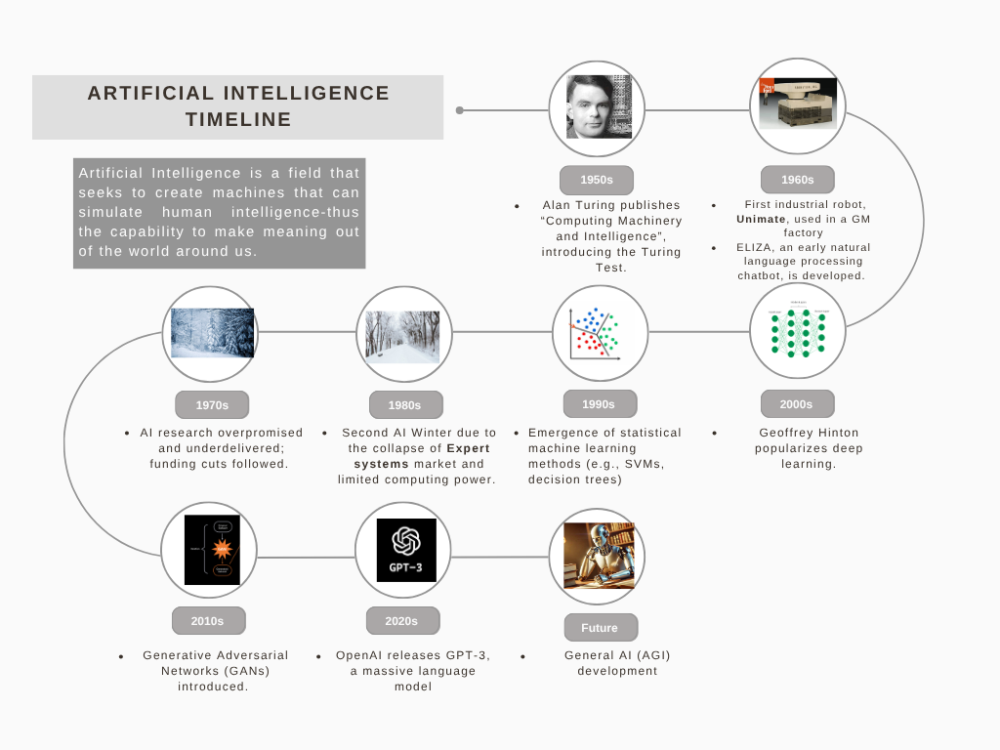

### **Project Showcase: The AI Timeline**

#### **Introduction**

In an era defined by the rapid acceleration of artificial intelligence, it is easy to perceive AI as a recent phenomenon. However, its roots run deep, spanning decades of theoretical work, ambitious experiments, and cycles of boom and bust. This project, the "AI Timeline," was created to provide a clear and accessible historical context for the field, tracing its journey from ancient philosophical concepts to the powerful generative models of today.

-----

#### **Actual Artifact**

The artifact consists of two components: a detailed blog post written in Markdown and a complementary visual infographic summarizing the key milestones.

**1. Visual Infographic**

The infographic provides a high-level, visually engaging overview of the major eras and breakthroughs in AI history.

\

**2. Blog Post / Article Content**

The following is the full text of the accompanying article, designed for a blog or website.

> ```markdown
> ---
> layout: blog
> type: blog
> title: "AI Timeline"
> # All dates must be YYYY-MM-DD format!
> date: 2025-07-12
> published: true
> labels:
>   - Artificial Intelligence
>   - Learning
> ---
> ```

> # **Timeline of Artificial Intelligence**

> ## **Before 1950 – Foundations**
>
>   - **Ancient Times**: Myths of mechanical men (e.g., Greek Talos, Jewish Golem).
>   - **1642**: Blaise Pascal creates the first mechanical calculator.
>   - **1837**: Charles Babbage conceptualizes the Analytical Engine.
>   - **1854**: George Boole develops Boolean algebra — essential for binary computing.
>   - **1936**: Alan Turing proposes the Turing Machine, laying groundwork for modern computing.

> ## **1950s – Birth of AI**
>
>   - **1950**: Alan Turing publishes “Computing Machinery and Intelligence”, introducing the Turing Test.
>   - **1951**: Marvin Minsky and Dean Edmonds develop the first artificial neural network (SNARC).
>   - **1952**: Arthur Samuel develops the first self-learning game program (Checkers).
>   - **1956**: Term “Artificial Intelligence” coined at the Dartmouth Conference (John McCarthy, Marvin Minsky, Claude Shannon).
>   - **1958**:
>       - John McCarthy develops LISP, the first AI programming language.
>       - Frank Rosenblatt develops the perceptron, an early ANN.
>   - **1959**: Arthur Samuel coins the term "machine learning".

> ## **1960s – Early Exploration**
>
>   - **1961**: First industrial robot, Unimate, used in a GM factory.
>   - **1966**: ELIZA, an early natural language processing chatbot, is developed.
>   - **1969**: Shakey the Robot — first robot that can reason about its actions.

> ## **1970s – First AI Winter**
>
>   - AI research overpromised and underdelivered; funding cuts followed.
>   - Rule-based systems struggled with real-world complexity.

> ## **1980s – Expert Systems Boom**
>
>   - **1980s**: Expert systems like XCON used for business applications.
>   - **1987–1993**: Second AI Winter due to collapse of expert systems market and limited computing power.

> ## **1990s – Machine Learning Emerges**
>
>   - **1997**: IBM’s Deep Blue defeats world chess champion Garry Kasparov.
>   - Emergence of statistical machine learning methods (e.g., SVMs, decision trees).

> ## **2000s – Data & Internet Era**
>
>   - Explosion of data and computing power.
>   - **2002**: First commercially available robotic vacuum, Roomba.
>   - **2006**: Geoffrey Hinton popularizes deep learning.

> ## **2010s – Deep Learning Revolution**
>
>   - **2011**: IBM’s Watson wins Jeopardy.
>   - **2012**: AlexNet wins ImageNet competition — major deep learning breakthrough.
>   - **2014**: Generative Adversarial Networks (GANs) introduced.
>   - **2016**: Google DeepMind’s AlphaGo defeats world champion Lee Sedol in Go.

> ## **2020s – Generative AI & Foundation Models**
>
>   - **2020**: OpenAI releases GPT-3, a massive language model.
>   - **2021**: GitHub Copilot released using Codex.
>   - **2022**: ChatGPT launches, sparking public AI adoption.
>   - **2023**: GPT-4 released with multimodal (text + image) capabilities.
>   - **2024**: Explosion of AI agents, video models (e.g., Sora), and open-source LLMs (e.g., LLaMA, Mistral, Gemma).

> ## **Future – What’s Next?**
>
>   - General AI (AGI) development.
>
> <!-- end list -->
>
> ```
> ```

-----

#### **Objective**

The primary goal was to demystify the history of Artificial Intelligence. I aimed to create an educational resource that is both comprehensive and easily digestible for a diverse audience, including students, tech enthusiasts, and professionals seeking to understand the context behind today's AI headlines.

#### **Process**

1.  **Research & Curation:** I began by researching and compiling a list of the most significant events, figures, and technological advancements in the history of AI. Sources included academic texts, historical articles, and seminal research papers.
2.  **Structuring the Narrative:** The collected data points were organized chronologically and then grouped into distinct, thematic eras (e.g., "Birth of AI," "First AI Winter," "Deep Learning Revolution"). This narrative structure helps in understanding the trends, challenges, and breakthroughs over time.
3.  **Content Authoring:** I wrote the descriptive text for each milestone in Markdown, ensuring the language was concise and clear. The content was structured with headers and lists for maximum readability.
4.  **Infographic Design:** Using the structured text as a blueprint, I designed the visual timeline. The process involved creating a layout, selecting a complementary color palette and typography, and using icons and graphics to represent key events, resulting in the final `AI-Timeline.png` file.
5.  **Integration:** The final step was to embed the infographic within the Markdown article, creating a cohesive piece where the text provides detail and the visual offers a quick summary.

#### **Tools and Technologies**

  * **Content Creation:** Markdown
  * **Visual Design:** Figma / Adobe Illustrator
  * **Research:** Google Scholar, ACM Digital Library, arXiv
  * **Version Control:** Git & GitHub

#### **Value Proposition**

This project serves as a valuable educational tool that synthesizes a complex and expansive history into a simple, coherent format. It provides context, illustrates the non-linear path of innovation, and grounds the current AI boom in decades of prior work.

  * **Unique Value:** The combination of a detailed textual article with a visually striking infographic provides a multi-modal learning experience. Users can get a quick overview from the graphic or dive deeper with the text, catering to different learning preferences and levels of interest.
  * **Relevance:** In the current climate of rapid AI development, understanding its history is more critical than ever. This timeline helps contextualize modern breakthroughs, appreciate the foundational concepts that made them possible, and understand the historical hype cycles, which offers valuable perspective on the future trajectory of the field.

#### **References**

  * Russell, S. J., & Norvig, P. (2020). *Artificial Intelligence: A Modern Approach (4th ed.)*. Pearson.
  * Turing, A. M. (1950). Computing Machinery and Intelligence. *Mind*, *LIX*(236), 433–460.
  * McCarthy, J., Minsky, M. L., Rochester, N., & Shannon, C. E. (1955). A Proposal for the Dartmouth Summer Research Project on Artificial Intelligence.
  * Nilsson, N. J. (2009). *The Quest for Artificial Intelligence: A History of Ideas and Achievements*. Cambridge University Press.

