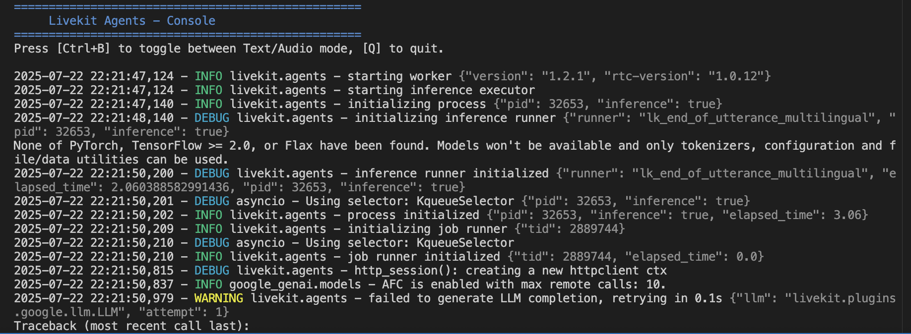

JARVIS AI is an Iron Man inspired AI Voice Agent which runs on your machine. This application uses LiveKit to create a server which consists of a pipeline of a STT (Speech-to-Text) module, a LLM and TTS (Text-to-Speech) module. The TTS package used in this project is Deepgram and we need to create an API key before using this in our project, Deepgram converts your speech into text which is used as input to the LLM. You can use another STT package which you are comfortable with and here is a list of other compatible [providers.](https://docs.livekit.io/agents/integrations/stt/#providers)

The LLM used in this particular project is Gemini but it can be replaced with another LLM [provider.](https://docs.livekit.io/agents/integrations/llm/#providers) I used the Realtime Gemini to test the Video input and the model works really well and can be utilized to provide Realtime outputs to user prompt via video. The prompt is then provided to a TTS module.

The TTS package converts the prompts into speech and speaks it, the package used in this project is from Cartesia and requires creating API Keys to use it. The Cartesia package has support for different accents and languages and I want to test out the other languages in the next iteration of this project. Again there is support for [other packages](https://docs.livekit.io/agents/integrations/tts/#providers) for TTS within the LiveKit ecosystem.

Overall this was a fun project to work on as I am a Marvel's fan and JARVIS (Just A Rather Very Intelligent System) is one of my favorite characters. The next step would be adding more functions (currently supports weather API and search API) for the LLM to use and deploying this in a local environment for daily task automation. The possibilities are endless when working with such systems. I'll keep your guys posted.

Source: <a href="https://github.com/aaryaneil/JARVIS-AI"><i class="large github icon "></i>aaryaneil/JARVIS-AI</a>
